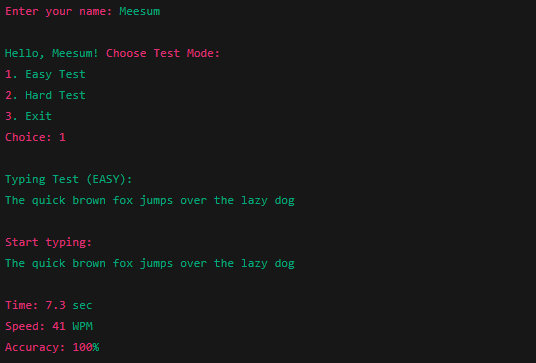

# CppTypingMaster
Test your typing speed like a pro! A simple yet powerful C++ OOP project that measures your WPM and accuracy with Easy &amp; Hard modes.

Features

📝 Easy and Hard typing test modes.

⏱️ Calculates time taken automatically.

⚡ Measures typing speed in Words Per Minute (WPM).

🎯 Calculates accuracy percentage.

👤 User-friendly interface with username input.

📚 Implements OOP principles (Encapsulation, Inheritance, Polymorphism, Virtual Functions).

🛠️ Tech Stack

Language: C++

Concepts Used:

Classes & Objects

Encapsulation

Inheritance

Polymorphism

Virtual & Pure Virtual Functions

📂 Project Structure

User → stores user information.

Test → abstract base class (pure virtual).

EasyTest & HardTest → derived classes implementing test logic.

## 📸 Sample Output  

Future Enhancements

Add medium difficulty level.

Store results in files (history).

Implement leaderboard system.

Smarter accuracy calculation (word-level comparison).

main.cpp → entry point.
